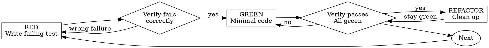

# Test-Driven Development (TDD)

## Core Principle

```
NO PRODUCTION CODE WITHOUT A FAILING TEST FIRST.
If you didn't watch the test fail, you don't know if it tests the right thing.
Violating the letter of the rules is violating the spirit of the rules.
```

## The Iron Law

```
NO PRODUCTION CODE WITHOUT A FAILING TEST FIRST
```

Write code before the test? Delete it. Start over.

## Red-Green-Refactor



### RED - Write Failing Test

Write one minimal test showing what should happen.
- One behavior
- Clear name
- Real code (no mocks unless unavoidable)

### Verify RED - Watch It Fail

**MANDATORY. Never skip.**

Confirm: Test fails (not errors), failure message is expected, fails because feature missing.

### GREEN - Minimal Code

Write simplest code to pass the test. Don't add features, refactor other code, or "improve" beyond the test.

### Verify GREEN - Watch It Pass

**MANDATORY.** Confirm test passes, other tests still pass, output pristine.

### REFACTOR - Clean Up

After green only: Remove duplication, improve names, extract helpers. Keep tests green.

## Testing Anti-Patterns

Read `testing-anti-patterns.md` in this directory for detailed guidance on:
- Testing mock behavior instead of real behavior
- Adding test-only methods to production classes
- Mocking without understanding dependencies

## Common Rationalizations

| Excuse | Reality |
|--------|---------|
| "Too simple to test" | Simple code breaks. Test takes 30 seconds. |
| "I'll test after" | Tests passing immediately prove nothing. |
| "Deleting X hours is wasteful" | Sunk cost fallacy. Keeping unverified code is technical debt. |
| "TDD will slow me down" | TDD faster than debugging. |

## Red Flags - STOP and Start Over

- Code before test
- Test passes immediately
- Can't explain why test failed
- Rationalizing "just this once"

## Quick Reference

| Dimension | Key point |
|-----------|-----------|
| Cycle | RED → Verify RED → GREEN → Verify GREEN → REFACTOR |
| Red phase | One behavior, one test, watch it fail first |
| Green phase | Minimal code to pass, no extra features |
| Refactor | Only after GREEN, keep tests green |
| Forbidden | Code before test / skip Verify / "just this once" |

## Verification Checklist

Before marking work complete:

- [ ] Every new function/method has a test
- [ ] Watched each test fail before implementing
- [ ] Wrote minimal code to pass each test
- [ ] All tests pass
- [ ] Output pristine (no errors, warnings)
- [ ] Tests use real code (mocks only if unavoidable)

Can't check all boxes? You skipped TDD. Start over.

## Next Step

When done:
- Normal case → return to caller (usually `tn:assemble` or `tn:diagnose`)
- Tests still failing after **3 RED→GREEN attempts** on the same behavior → invoke `tn:diagnose` for systematic root-cause investigation (matches `tn:diagnose`'s 3-attempt limit — do not keep guessing past 3)
- User requests stop → end the current flow

## Guardrails

- No production code without a failing test first — delete and start over if violated
- Verify RED is MANDATORY — never skip watching the test fail
- Verify GREEN is MANDATORY — never skip watching the test pass
- Violating the letter of the rules is violating the spirit of the rules
- Use real code in tests — mocks only when unavoidable
- Read `testing-anti-patterns.md` for detailed anti-pattern guidance
